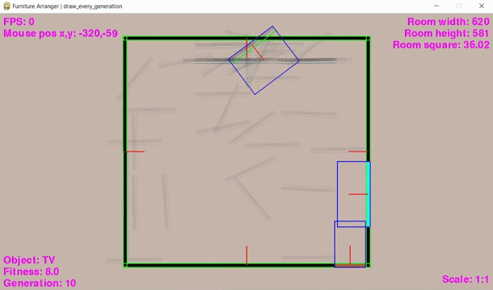

GUI программа на pygame, использующая *Генетический Алгоритм (ГА)* для динамической расстановки мебели в 3D пространстве комнаты.
Набор мебели и правила расстановки задаются вручную, всё остальное софт делает сам.

🎥🔦

В софте также присутствуют: возможность ручного управления камерой и мебелью, просмотра градиента фитнесса, режима отладки.
